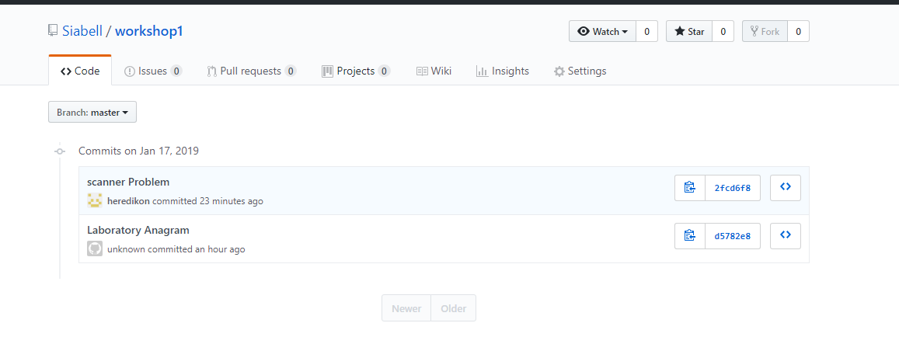

# Workshop 1
What is the purpose of this command? git add .

> This command adds the changes made to the folder into the local repository

Why we used it? git commit -m "Laboratory Anagram"
> this command makes a local commit and creates a log using the message inside the quotes.
> 
What is the purpose of this command? git push origin master
> it saves the changes made locally into the online repository created in github.com.
>  

What is the purpose of this command? git clone "server"
> it clones the contents of the repository  in the url named instead of "server" and automatically links the local and online repositories

Report of github commits

What that command does? git pull origin master

> it pulls changes in the origin repository and merge it in the local repository.
