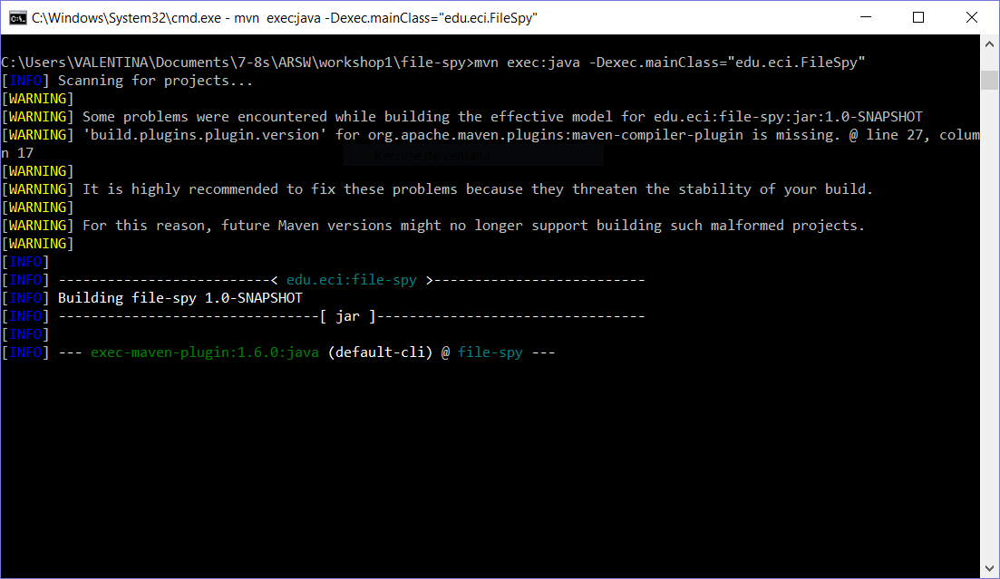

# Git Basic Concepts

What is the purpose of this command? git add .

> This command adds the changes made to the folder into the local repository

Why we used it? git commit -m "Laboratory Anagram"
> this command makes a local commit and creates a log using the message inside the quotes.
> 
What is the purpose of this command? git push origin master
> it saves the changes made locally into the online repository created in github.com.
>  

What is the purpose of this command? git clone "server"
> it clones the contents of the repository  in the url named instead of "server" and automatically links the local and online repositories

Report of github commits

What that command does? git pull origin master

> it pulls changes in the origin repository and merge it in the local repository.

# Maven Basic Concepts

  

creation screenshot

  

  

1. What do means the -B option in the command?

  

> Ejecutar en modo no interactivo (batch), este utilizará automáticamente los valores predeterminados en lugar de pedirlos.

  

2. What do means the -D option in the command?

  

> Define una propiedad del sistema, es utilizada para personalizar el comportamiento de los complementos de maven, las propiedades definidas en la línea de comandos también están disponibles como propiedades que se utilizaran en un POM de maven.

  

3. What do means the groupId, artifactId properties in the command?

  

>- groupId: Este indica el único identificador de la organización que creo el proyecto, por lo que sigue las reglas de nombres de paquetes.

  

>- artifactId: Este es el nombre único del artefacto primario creado (sirve como el identificador local del grupo del proyecto maven), este generalmente es un archivo jar.

  

4. Describe the content of the directory that has been created.

  
  

  

> Podemos ver en la carpeta de fuentes(src) la organización creada en el groupId; se genera un archivo pom dónde está los dependencias del proyecto y por último se crea una carpeta donde se harán las pruebas pertinentes al proyecto que también está en src.

  

5. Create the folders ``src/main/resources` and `src/test/resources``

  

  

# POM file

  

  

- What do means the word SNAPSHOT in the version value?

  

>Esto significa que el proyecto está en desarrollo, es decir no es version 1.0 aun.

  

- What is the purpose of the packing tag into the POM file?

  

> Es el empaquetamineto que tendrá la carpeta del proyecto según el tipo de proyecto que se este realizando (jar, war, ear, etc).

  

- What is the purpose of the dependencies and dependency tags into the POM file?

  

>Dependency tags: Esta es la sección de dependencias para centralizar la información, proporciona la capacidad de manipular artefactos, puede copiar y / o desempaquetar artefactos de repositorios locales o remotos a una ubicación específica.

  

## Dependency Management

- Go to the MVNRepository and search for`tika-core` library. Add a new dependency to the POM file with the last version of this library.

- Replace the App class in the source folder with the FileSpy class provided in the workshop.

- What is the functionality of this class?

  

> Esta clase revisa un path en el sistema e informa si se han creado o modificado archivos de tipo cvs.
  

## Building Lifecycles and Plugins

  

Maven is based on the idea of a build lifecycle which refers to the process of assembling and distributing an artifact like a JAR file. Maven ships with three lifecycles and you can think of them in terms of distributing an application.

  

Now within lifecycle, there are phases. For examples, some of the phases that make up the default build lifecycle are the `compile`, `test`, `package`, and `install` phases.

  
  

- The three principal Maven lifecycles are`clean`, `default`and `site`. Describe each one.

>- clean = maneja la limpieza del proyecto.

>- default = maneja la implementación del proyecto.

>- Site = se encarga de la creación de la documentación.

- Using the terminal execute the command `mvn compile`. Take the output screenshot. What is this command using for? What are transitive dependencies?

  

>- mvn compile: compila el código fuente del proyecto.

>- Transitive dependencies: Maven evita la necesidad de descubrir y especificar las bibliotecas que requieren sus propias dependencias mediante la inclusión automática de dependencias transitivas, Esta función se facilita al leer los archivos de proyecto de sus dependencias en repositorios remotos especificados, así el proyecto "hereda" todas las dependencias que son dependencias de sus "padres" o dependencias directas, sin límite para la cantidad de niveles desde donde se puede recopilar las dependencias.

- Using the terminal execute the command `mvn package`. Take the output screenshot. What is this command using for?

  

>- mvn package: toma el código compilado y lo empaqueta en su formato distribuible ( como jar).

- Using the terminal execute the command `mvn install`. Take the output screenshot. What is this command using for?

  

>- mvn install: instala el paquete en el repositorio local, para usarlo como una dependencia en otros proyectos localmente.

- Generate a new maven project in other folder using the maven command line tools, this project should has as groupId "edu.eci" and as artifactId "another-maven-project". Take the output screenshot.

- Replace the code of the App.java class with the following code and do all the necessary steps to compile the code.

  

## Task:

  

- Use the following command to execute the file-spy application `mvn exec:java -Dexec.mainClass="edu.eci.FileSpy"`. Take the output screenshot.

- But this time you should knew that the application detect events in a folder when you add new files and print on the screen all the files with the `text/csv` extension. Test the application using the examples files. Take the output screenshot.

- Integrantes: Fabian Bohorquez, Valentina Siabatto
